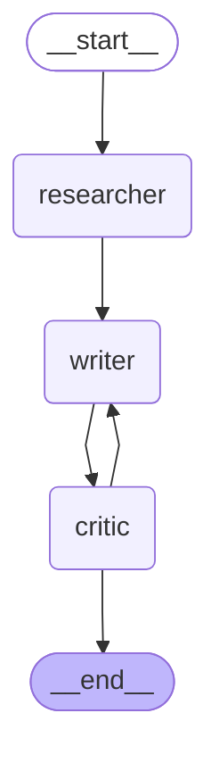

# 📝 Research & Writing Agent

A multi-agent pipeline built with LangGraph that researches a topic, drafts content, and iteratively refines it through a critic feedback loop.

## 🔄 Architecture



## 🤖 Agents

| Agent | Role |
|-------|------|
| **Researcher** | Gathers and synthesizes information on the given topic |
| **Writer** | Drafts content based on the researcher's output |
| **Critic** | Reviews the draft and either approves it or sends it back for revision |

## 🚀 Getting Started

```bash
pip install langgraph langchain
python main.py
```

## 🛠️ Tech Stack

- [LangGraph](https://github.com/langchain-ai/langgraph) — agent orchestration
- [LangChain](https://github.com/langchain-ai/langchain) — LLM tooling
